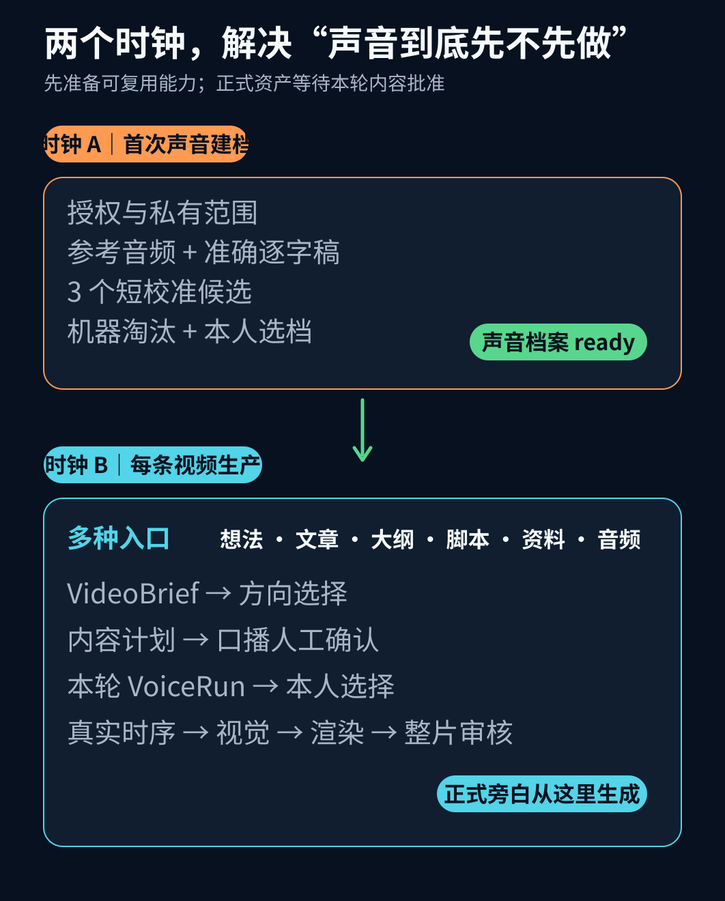
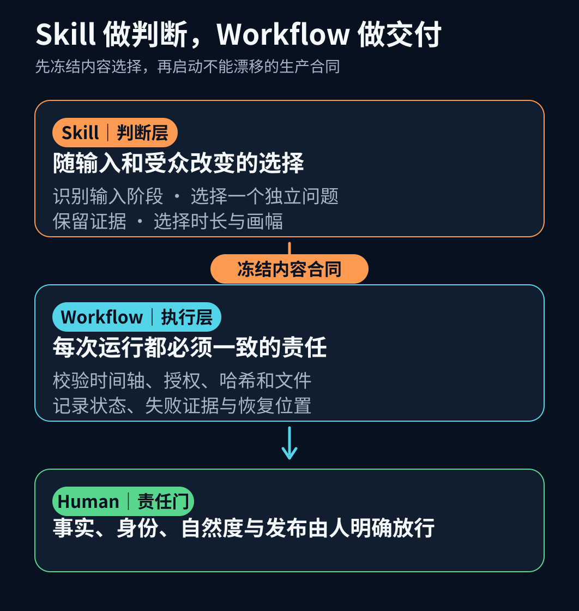
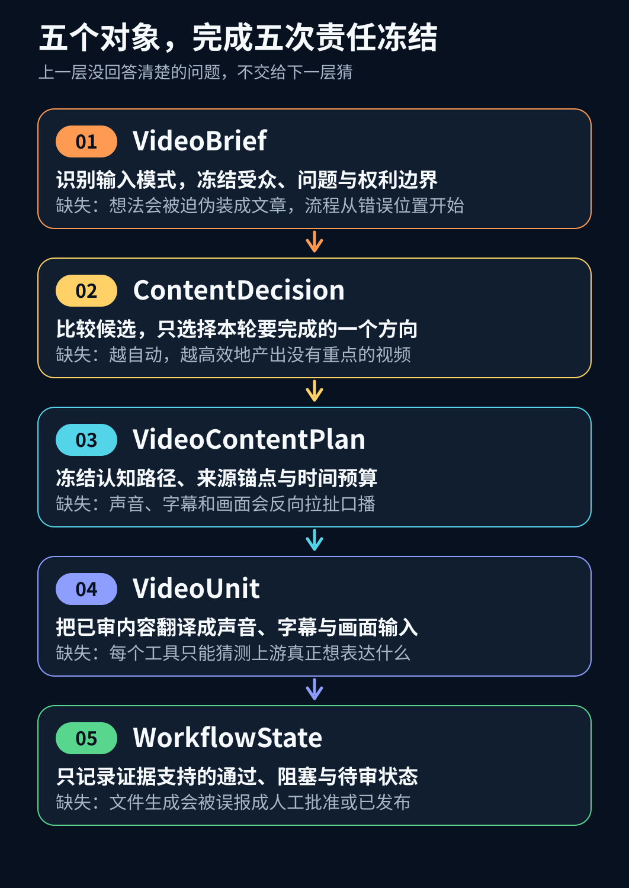
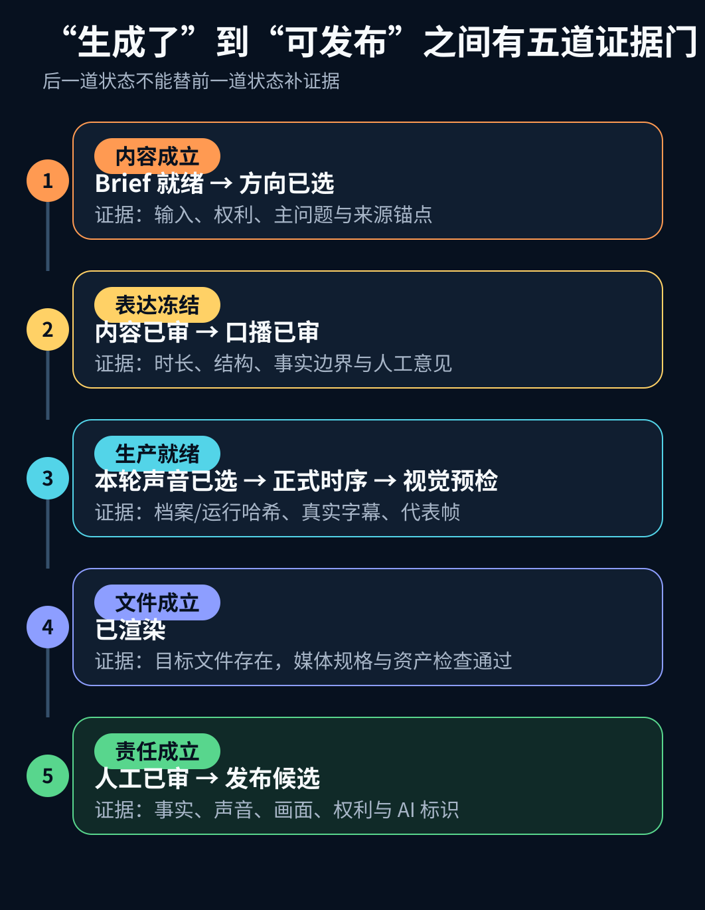
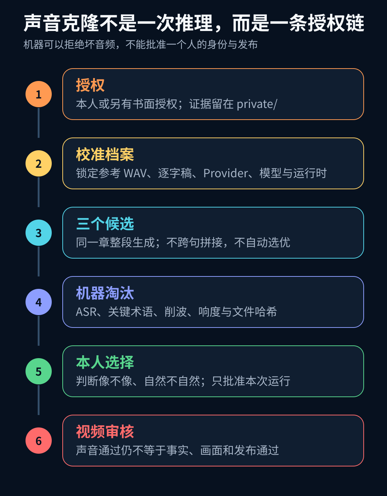

# 做 AI 视频，别把文章当成唯一入口

> 我的答案是：用 Skill 做判断，用 Workflow 做交付；把“首次声音建档”和“每条视频生产”拆成两个时钟。

假设你现在只有一句想法：

> 我想讲清楚，为什么做 AI 视频时，声音克隆应该先准备好，但正式旁白又不能在文案确认之前生成。

这已经足够开始做视频。你不需要先把它扩写成一篇六千字文章，再让系统把文章压回一分钟。

文章当然是很好的输入：它自带背景、证据和较完整的论证。但它只应该是入口之一。用户还可能带来一个想法、一份大纲、一版脚本、一组资料，甚至一段已经录好的声音。真正通用的视频生产能力，应当先识别输入处于什么阶段，再补齐当前缺少的判断。

这也是我重新整理这套开源能力时，最先修正的地方：不再让流程从“读取文章”开始，而是从 `VideoBrief` 开始。

开源示例直接使用一份想法笔记。运行校验器时，它会返回：

```text
valid
input=idea candidates=2 selected=two-clock-video-production
durationMs=72000 release=local_package
```

`valid` 只表示输入、候选、时间轴、文件引用和状态顺序符合合同。`local_package` 则明确表示：这仍是本地产物，不等于正式旁白已经生成，不等于本人完成听审，也不等于视频已经发布。

这条边界非常重要。做 AI 视频，最危险的结果不是没有生成文件，而是系统交出一个 MP4，所有人便以为任务已经完成。

## 先回答两个问题：做成 Skill，还是 Workflow？声音要不要先做？

这两个问题其实指向同一个架构原则：**需要根据上下文变化的部分，不能被固定流程过早锁死；需要留下证据的部分，也不能只靠模型临场发挥。**

[OpenAI 对 Skill 的说明](https://openai.com/academy/skills/)强调，它可以把可复用的任务方法与所需资源、脚本一起打包。在这个项目里，我把两层责任进一步拆开：

- **Skill** 负责理解输入、补齐问题、比较候选、选择叙事、设计表达和决定何时暂停；
- **Workflow** 负责字段合同、状态顺序、文件校验、哈希追踪、失败恢复和发布门禁；
- **人** 负责事实、身份、自然度和对外发布的最终判断。

声音也不能简单回答成“先做”或“后做”。更准确的答案是：

- 首次使用本人的克隆声音时，先完成一次低频的声音能力建档；
- 每条视频的正式旁白，仍然要等这条视频的内容和口播被确认之后再生成。

一个是“建立可复用生产能力”，另一个是“为当前视频生产最终资产”。混在一起，节奏一定会乱。



*图 1：声音档案可以先准备，但正式旁白必须依赖已确认的本轮文案。文章只是每条视频输入路由中的一种。*

## 为什么不该让“文章转视频”占据最开始

如果流程第一个动作是“读取文章”，系统会暗中制造两个限制。

第一，它会把没有文章的想法拒之门外。用户为了进入流程，只能先伪造一篇文章，带来一轮没有必要的扩写和压缩。

第二，它会让文章结构支配视频结构。文章适合铺陈，视频更依赖冲突、转折、视觉关系和时间预算。把目录直接变成分镜，通常只会得到会动的 PPT。

因此，新入口先判断输入模式：

| 输入模式 | 用户已有的材料 | Skill 首先补什么 |
| --- | --- | --- |
| `idea` | 一句话、问题或零散思路 | 受众、主问题、结论假设和候选方向 |
| `article` | 完整文章 | 可独立成片的问题、证据锚点和删减边界 |
| `outline` | 章节或要点 | 叙事顺序、转折与缺失证据 |
| `script` | 已有口播 | 事实边界、节奏、视觉任务和审核点 |
| `source-pack` | 多份资料 | 来源权利、冲突事实和可验证结论 |
| `audio` | 已录声音或采访 | 转写、说话人边界和可视化结构 |

不同入口最终都归一成同一个 `VideoBrief`。后面的候选比较、内容计划、声音、字幕、画面和渲染，便不需要分别维护六套流程。

这就是 Skill 的价值：它复用的不是同一个输入模板，而是“看清当前材料以后，下一步应该补什么”的判断方法。

## 为什么也不能只做成 Skill

Skill 可以理解语境、比较候选、设计口播，也能给出很漂亮的分镜。但如果项目停在这里，仍然没有形成生产能力。

生成式判断天然存在波动。今天它可能写出 7 个场景，明天变成 8 个；这次记得给每段绑定来源，下次可能漏掉；它也可能说“视频已经完成”，却没有检查文件是否存在，或者把“机器检查通过”误写成“本人已经批准”。

当内容和口播冻结以后，剩下的事情就不应该继续依赖模型临场发挥：

- 时间轴必须从 0 开始、连续并覆盖完整时长；
- 每个场景只能承担一个主要视觉任务；
- 声纹合成必须有授权，参考和成片要能通过哈希追踪；
- 估算字幕只能用于画面草案，不能冒充正式对齐；
- 渲染成功必须由实际产物和媒体检查证明；
- 人工没有确认的事项，状态只能是 `pending`。

这部分应该由 Workflow 接管。Workflow 的价值不是“多自动几步”，而是把不能漂移的责任写成合同。



*图 2：Skill 可以改变选择，但不能绕过门禁；Workflow 可以执行合同，但不能替代内容判断。*

## 五个对象，把多入口视频生产接成一条线

为了让两层真正接得起来，我没有让 Skill 直接输出 Remotion 代码，而是让它依次冻结五类对象。



*图 3：五个对象不是五份形式文档，而是五次责任冻结。上一层没有回答清楚的问题，不应交给下一层猜。*

### 1. VideoBrief：说明现在拥有什么、要解决什么

`VideoBrief` 记录输入模式、源文件、目标受众、主问题、期望动作、渠道、时长倾向、权利边界和待核实事实。

它不要求所有输入都伪装成文章。一个想法可以从澄清主问题开始；一版成熟脚本则可以直接进入事实和节奏检查。

### 2. ContentDecision：比较候选，只选一个方向

`ContentDecision` 保存 2 到 6 个可独立成立的候选。每个候选都要写清核心判断、受众动作、来源锚点、核实需求、时长建议和视觉潜力，本轮只能推荐一个。

这个对象解决的不是“怎么写得更多”，而是“这次究竟做什么”。如果输入是文章，它会完成文章切片；如果输入只是一句话，它会把一句话展开成几个可比较的视频问题。

### 3. VideoContentPlan：先冻结认知路径

方向确定以后，再设计开场冲突、认知重构、机制或证据、产品动作和适用边界。每一段都有时间预算、口播职责、表达意图、来源锚点和唯一视觉任务。

在这套项目策略里，45 秒用于纠正一个误判，75 秒用于讲清一个机制或比较，105 秒用于带证据的案例复盘；只有一个问题确实需要 3 到 5 个相互依赖的章节时，才进入课程母版。这些是内容预算，不是行业标准。

### 4. VideoUnit：把已审内容翻译成生产输入

`VideoUnit` 才进入制作层。它记录完整时长、画幅、声音模式、授权范围、字幕来源和逐段 beat，让声音工具、字幕工具与渲染器消费同一份已审输入。

每个 beat 只能有一个主要任务：建立冲突、解释机制、做比较、展示证据、给出动作，或者收束结论。画面负责关系、状态和证据，口播负责原因、使用方式和边界，字幕负责跟随声音。

### 5. WorkflowState：只用证据定义“做到哪了”

`WorkflowState` 不保存“感觉已经差不多”，只保存每一道门当前是 `pending`、`passed`、`blocked`、`failed` 还是 `not_applicable`，以及证明这个状态的产物。



*图 4：文件存在、技术通过和人工批准是三种不同事实，后一道状态不能替前一道状态补证据。*

`rendered` 只证明目标视频文件已经生成并通过技术检查；`human_reviewed` 才表示事实、口播、声音、画面、权利和 AI 标识经过人工判断；`approved` 才能进入发布候选。

同样，本地包、平台草稿、完整预览、定时发布和已经上线也是不同事实。一个平台完成，不代表另一个平台完成。

## 声音克隆的正确节奏：先建档，再按条生产

现在回到最容易混乱的问题：是不是应该先做声音克隆？

如果这是第一次使用一个人的克隆声音，答案是：**先做声音能力建档，比做到一半才发现声音不可用更合理。**

但这里的“先做”，不是拿一篇尚未确认的正式稿直接生成整段旁白。正确的首次建档流程是：

1. 确认声音所有者、用途、保存范围、是否允许上传第三方，以及撤回方式；
2. 准备干净的参考音频和准确逐字稿，记录文件哈希；
3. 用自然的短校准文本生成三个候选，而不是直接生成完整视频；
4. 机器淘汰漏字、重复、削波或明显异常的候选；
5. 由声音所有者判断“像不像我、自然不自然”，明确选中一个可复用档案；
6. 只有档案状态达到 `ready`，后续视频才允许选择克隆声音模式。

每条视频则运行另一条节奏：

`选择输入 → 冻结 VideoBrief → 选择内容方向 → 审核口播 → 生成本轮声音候选 → 本人选择 → 真实时序 → 视觉预检 → 渲染 → 人工审核`

为什么正式旁白不能更早生成？因为每次内容修改都会改变停顿、重音、字幕和画面节奏。如果在文案确认前就生成正式声音，所谓“声音先行”只会变成重复返工。

因此，开源实现把两类对象分开：`VoiceProfile` 负责可复用的授权、参考音频、逐字稿、Provider、模型指纹和校准结果；`VoiceRun` 负责当前视频的文本、参数、三个候选、机检结果与本人选择。一次 `VoiceRun` 被批准，只代表这次声音可用，不等于整条视频获准发布。



*图 5：机器负责淘汰坏音频，声音所有者负责身份与自然度判断；声音审核和视频发布审核不能互相替代。*

开源仓库提供 Qwen3-TTS MLX 本地 Provider、档案与运行 CLI、机检脚本和默认禁用的授权模板；实现接口参考 [Qwen3-TTS 官方仓库](https://github.com/QwenLM/Qwen3-TTS)、[`mlx-audio` 的 Qwen3-TTS 声音克隆说明](https://github.com/Blaizzy/mlx-audio/blob/main/mlx_audio/tts/models/qwen3_tts/README.md)和 [MLX Base 模型卡](https://huggingface.co/mlx-community/Qwen3-TTS-12Hz-0.6B-Base-bf16)。仓库不包含任何人的声音、参考文本、授权证据、模型权重、已生成 WAV 或已接受档案。

## 视觉也不是“套模板”，而是选择证据载体

AI 视频很容易退化成连续翻页：大标题、三张卡、淡入淡出，再换下一页。技术上没有错，观看上却像会动的 PPT。

更实用的规则是先看信息的空间结构，再选画幅和视觉语言。机制图、横向流程、左右比较、产品界面和运行证据优先 16:9；人物和真实对象是主要锚点、内容只有一个快判断时，再考虑 9:16。横屏知识母版转竖屏，不做中心裁切，而是重写口播和重新构图。

视觉还需要语义接力。前一场选中的节点，要成为后一场展开的对象；鼠标点击以后，要看到状态反馈；展示“工具调用成功”时，下一步应该继续检查业务是否真的完成。真正的信息价值来自对象、动作和结果，而不是装饰动效的数量。

## 开源什么，不开源什么

这套能力适合拆成三层：

| 层 | 适合开源 | 保持私有 |
| --- | --- | --- |
| 判断层 | 多入口路由、候选比较、时长与画幅选择、来源锚点 | 账号选题策略、未发布内容 |
| 执行层 | JSON 合同、状态机、校验器、VoiceProfile/VoiceRun、示例包 | 平台凭据、内部发布记录、真实授权证据 |
| 适配层 | 通用渲染接口、本地声音 Provider、字幕格式 | 本人声纹、参考音频、模型权重、品牌资产 |

这个边界让开源 Skill 真正可用，同时不会为了“示例完整”泄露个人资产，也不会把某个项目的品牌和本机环境硬编码成所有人的默认值。

## 一个最小可运行的开源版本

通用部分已经整理成独立的 [`create-reviewable-ai-video`](../README.md) 开源候选。仓库根目录保留公开说明、测试和本文；可安装的 Skill 则保持标准目录结构。

它包含四部分：

1. `SKILL.md`：用中文说明多入口路由、两个时钟和停止条件；
2. `assets/example-package/`：提供从想法开始的五对象样例；
3. `scripts/validate-package.mjs`：零依赖检查输入、候选、时间轴、视觉任务、声音隐私、字幕来源和状态顺序；
4. `references/voice-cloning.md`：提供本地 Provider、校准档案、三候选、机检、本人选择和本轮视频绑定流程。

下载后先验证公开示例：

```bash
npm test
npm run validate:example
```

再把 `create-reviewable-ai-video/` 安装到 Skill 目录，复制示例生产包，并把输入换成自己的想法、文章、大纲、脚本、资料包或音频。校验通过只表示合同成立；它不会自动把状态推进到人工审核，更不会把本地文件说成已经发布。

## 三个问题，决定一项能力放在哪里

当你把自己的 AI 项目整理成可复用能力时，可以先问三个问题：

1. **输出是否必须随上下文改变？** 如果需要理解材料、比较候选、权衡受众和边界，它更适合进入 Skill。
2. **规则是否应该在每次运行中保持不变？** 如果可以写成字段、顺序、阈值、哈希或产物检查，它应该进入 Workflow。
3. **结果是否涉及事实责任、身份授权或对外发布？** 如果是，就保留明确的人类决策点；不要因为前两层自动化了，就把责任也自动化。

同一个项目里，三种答案通常会同时出现。真正成熟的自动化不是把所有步骤塞进一条链，而是让每一层只承担它能证明的责任。

## 最后：先准备能力，不要提前生产最终资产

声音克隆可以先做，但先做的是授权、参考、校准和本人选档；正式旁白仍要等文案批准。文章可以进入视频生产，但它只是输入路由之一；一句想法同样可以从 `VideoBrief` 开始。

所以，这套能力既不只是一个固定 Workflow，也不应该只是一个会写分镜的 Skill。

更可靠的方案是：

> Skill 负责做对选择，Workflow 负责把选择可靠地做完；人负责对事实、身份和发布结果承担最终责任。

当这三层各自守住边界，AI 才不只是帮我们更快地生成一个 MP4，而是在帮助我们建立一条可以复用、恢复、审核和持续改进的内容生产线。

---

本文的来源、版本与不作出的结论见[来源与证据边界](source-ledger-skill-workflow.md)。当前交付状态是本地文章包与本地开源候选；没有观察到 GitHub 发布、公众号导入、预览或正式发布。
